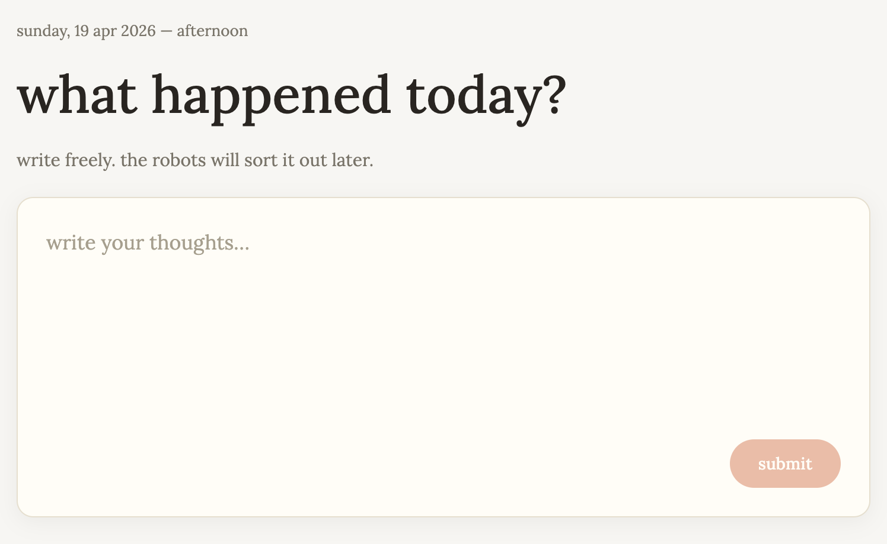

<p align="center">
  
</p>

<h1 align="center">chronicle</h1>

<p align="center">
  A private, local-first journal. Write freely. The robots sort it out later.
</p>



## About

Chronicle is a journaling app that runs entirely in your browser. Jot down what happened today and an on-device LLM analyzes sentiment and suggests tags — nothing leaves your machine.

- Local-first storage via TanStack DB with SQLite persistence (OPFS)
- On-device inference with [🤗 Transformers.js](https://huggingface.co/docs/transformers.js) running Gemma in a `SharedWorker`
- WebGPU when available, WASM fallback
- Installable PWA
- React 19 + React Compiler, TanStack Router, Vanilla Extract, Base UI

## Running locally

Requires Node 20+ and [pnpm](https://pnpm.io/).

```sh
pnpm install
pnpm dev
```

Open the URL Vite prints (default `http://localhost:5173`). First entry triggers a model download — it caches after that.

## Scripts

| Command        | What                                |
| -------------- | ----------------------------------- |
| `pnpm dev`     | Start Vite dev server               |
| `pnpm build`   | Type-check and build for production |
| `pnpm preview` | Serve the production build locally  |
| `pnpm lint`    | Run oxlint                          |
| `pnpm fmt`     | Run oxfmt                           |

## Browser requirements

For best performance, use a browser with WebGPU (recent Chrome/Edge). Firefox and Safari fall back to WASM, which is slower but works.
